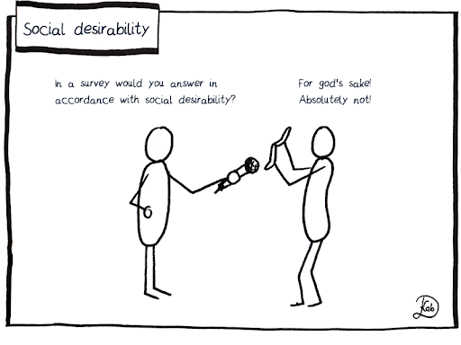
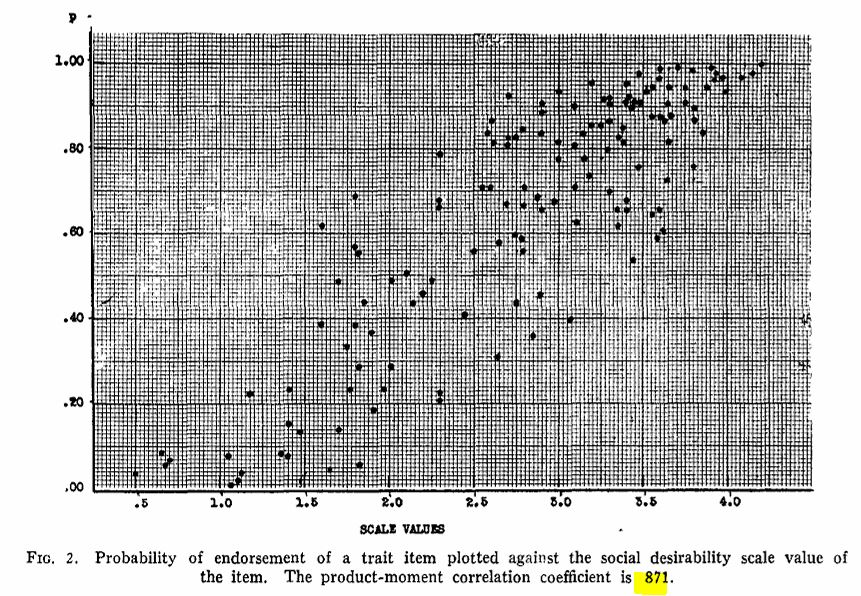
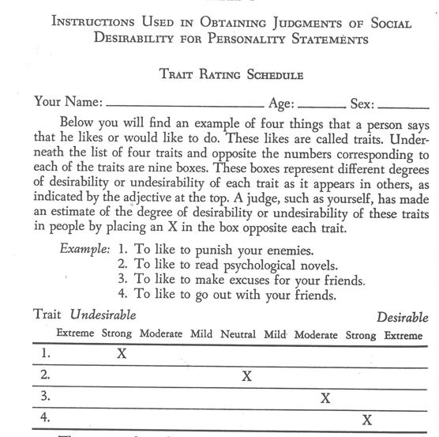
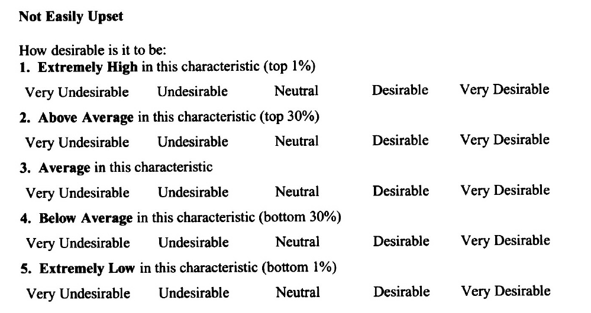
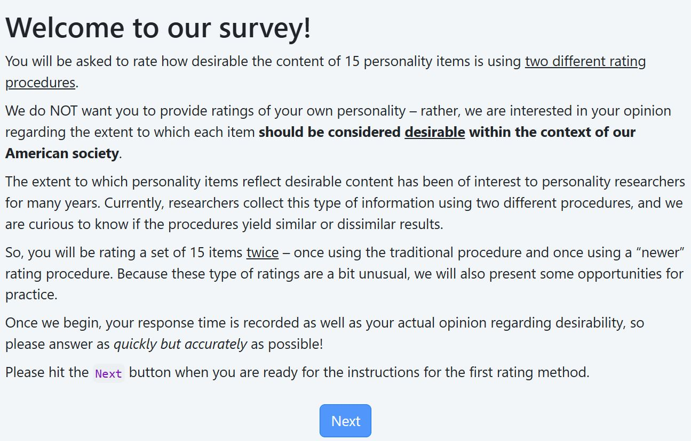

## The "problem"

Individuals [want to endorse]{.underline} desirable content within surveys^[aka inventories, questionnaires, polls, assessments] [@edwards1953social; @edwards1953relationship; @edwards1957social; @edwards_social_1957]

::: {.columns}

::: {.column width="50%" .fragment fragment-index=1}

+ individual differences [@li2006using]
+ contextual prompts [@viswesvaran1999meta]

:::

::: {.column width="50%" .smaller .fragment fragment-index=2}

One solution is to solicit ratings from OTHERs, but these OTHERs may actually be [MORE susceptible]{.underline} to socially desirable responding [@stachowski2020persnickety]

:::

:::

## The problem (cont)

::: {.columns}

::: {.column width="35%"}

 

>We don't, as a discipline (Psychology), really yet understand [**how**]{.underline} or [**why**]{.underline} people do this... 

:::

::: {.column width="60%"}
:::

:::

{.absolute right="-100" bottom="0" height="600"}

## What we [DO]{.underline} know...

If a survey item is obviously desirable, people will endorse, if the item is obviously [undesirable]{.underline}, people will deny:

::: {.columns}

::: {.column width="50%"}

### [YES!! THAT'S ME!!!]{.Smaller}

1. Never break promises
2. Help others in need
3. Am always well prepared
4. Treat others well

:::

::: {.column width="50%" .fragment}

### [What -- are you kidding?!?]{.Smaller}

1. Occasionally lie
2. Avoid pan--handlers
3. Steal from employer
4. Keep a messy room

:::
:::

## Allure of desirable content (empirical):

{#fig-sdscatter}

## How do we know what's desirable?

## Two Approaches

::: {.columns .Smaller}

::: {.column width="47%"}
### @edwards1957social:

:::

::: {.column width="53%" .fragment fragment-index=1}
### @kuncel_conceptual_2009:

:::
:::

{.absolute left="-150" bottom="-20"}
{.absolute right="-150" bottom="0" .fragment fragment-index=1}

## Current study

+ What are the similarities and differences between these two rating approaches?

  + How [reliable]{.underline} are the ratings provided from both procedures?
  + How [accurate]{.underline} are the ratings provided from both procedures?

+ The new one "**seems**" more cognitively difficult, but as Psychologists, we should investigate

## Issues

+ Asking individuals to [rate the item's level of desirability]{.underline} (rather than their own personality) is a very unusual request

+ Response latency as a DV -- imperfect but of interest

+ Comprehension of student participants -- particularly the @kuncel_conceptual_2009 rating procedure

We're relying on experimenters to help out & provide feedback as the experiment progresses...

# Let's check it out!!

## Cited References

