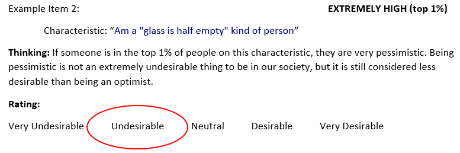
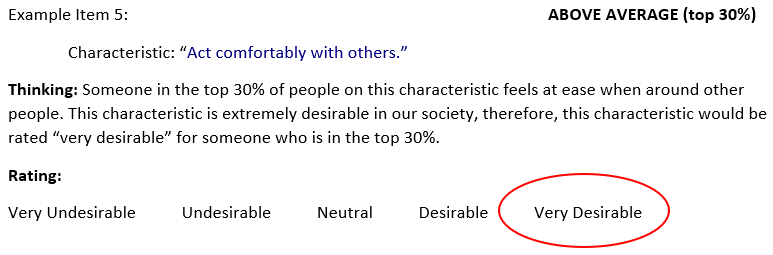
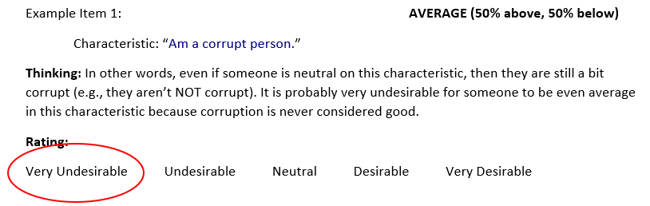
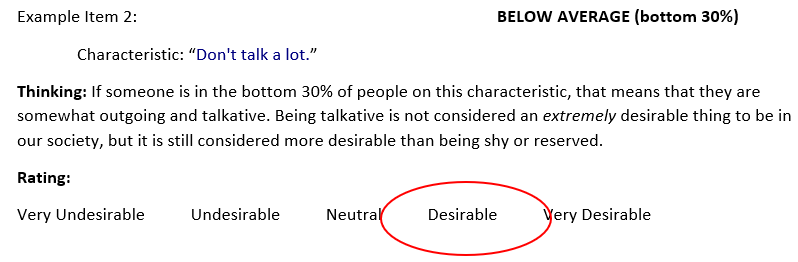
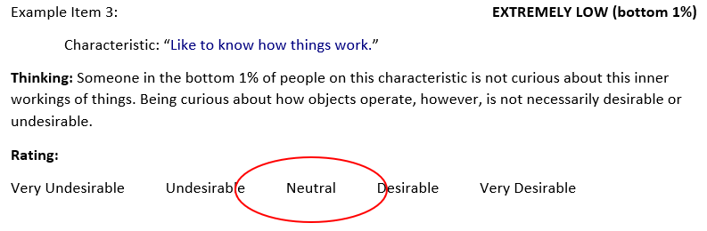
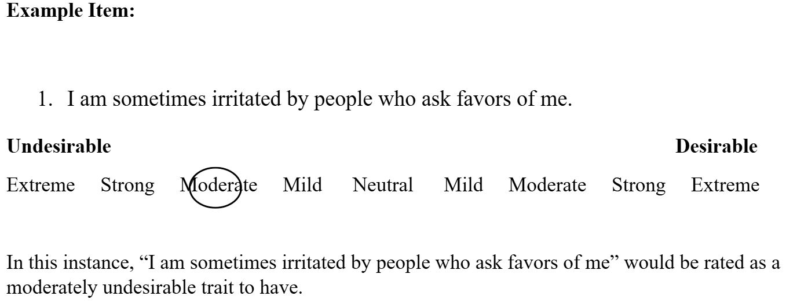

<script>
window.latencyTracker = {
  timers: {},
  init: function(questionId) {
    this.timers[questionId] = Date.now();
  },
  record: function(questionId, responseValue) {
    if (!this.timers[questionId]) this.init(questionId);
    var latency = Date.now() - this.timers[questionId];
    Shiny.setInputValue('latency_event', {
      questionId: questionId,
      responseValue: responseValue,
      latency: latency
    }, {priority: 'event'});
  }
};

function attachListeners() {
  document.querySelectorAll('input[type="radio"]').forEach(function(radio) {
    var id = radio.getAttribute('id');
    if (!id) return;
    var questionId = id.match(/^([a-zA-Z0-9_]+)/)[1];
    window.latencyTracker.init(questionId);
    radio.onclick = function() {
      window.latencyTracker.record(questionId, radio.value);
    };
  });
}

document.addEventListener('DOMContentLoaded', attachListeners);
(new MutationObserver(attachListeners)).observe(document.body, {childList: true, subtree: true});
</script>

```{r}
library(surveydown)      
library(shiny)

tags$style(HTML("
  body {
    font-size: 18px;
  }
  h1, h2, h3, h4, h5, h6 {
    font-size: 24px;
  }
  .sd-page {
    font-size: 18px;
  }
  .shiny-input-container select {
    font-size: 16px;
  }
  .shiny-input-container input[type='text'] {
    font-size: 16px;
  }
"))
```

```{r}
library(reshape2)
library(dplyr)

items <- read.csv("300itemstems.csv")
cat <- read.csv("KuncelTellegen Q Sort Items - Sheet1.csv")

names <- c("Plinear", "PEhook", "PMhook", "PS", "Ohook", "X", "witch", "uncat", "flat", "X1", "Nhook", "Nzshape", "NEhook", "Nlinear")
colnames(cat) <- names
rm(names)

test <- melt(cat)
test <- test[,3:4]
test <- as.data.frame(na.omit(test))
colnames(test) <- c("category","Itemnum")

Merged <- merge(x = items, y = test, by = "Itemnum", all = TRUE)
rm(cat,test,items)

PosLinear <- Merged %>%
  filter(category == "Plinear" | category == "PS")

PosHook <- Merged %>%
  filter(category == "PEhook" | category == "PMhook")

OPhook <- Merged %>%
  filter(category == "Ohook")

Witch <- Merged %>%
  filter(category == "witch")

Flat <- Merged %>%
  filter(category == "flat")

NegLinear <- Merged %>%
  filter(category == "Nlinear" | category == "Nzshape")

NegHook <- Merged %>%
  filter(category == "NEhook" | category == "Nhook")
```

```{r}
library(surveydown)      ## standard css specs not rendering as expected
library(shiny)

tags$style(HTML("
  body {
    font-size: 18px; /* Adjust the font size as needed */
  }
  h1, h2, h3, h4, h5, h6 {
    font-size: 24px; /* Adjust heading sizes */
  }
  .sd-page {
    font-size: 18px; /* Target Surveydown page content */
  }
  .shiny-input-container select {
    font-size: 16px;
  }
  .shiny-input-container input[type='text'] {
    font-size: 16px;
  }
"))
```

```{r}
## Creating a "second attempt" latency survey using the 11 Study 1 categories (although some categories will be "grouped"): Linear, hooked, non-mono, hooked(n), Linear(n)

library(surveydown)


##surveydown objects

##grab raw data numbers and key numbers from new categorization
##remove i and _ numbers from the raw data
##put key categorization as unlist tall data - will need to do the same for the other data
##join them on number, then put back into a wide dataset and create objects for each of the categories 

#install.packages("reshape2")
library(reshape2)
library(dplyr)

#grabbing item number and text
items <- read.csv("300itemstems.csv")

##grabbing categorizations
cat <- read.csv("KuncelTellegen Q Sort Items - Sheet1.csv")

##renaming categorizations
names <- c("Plinear", "PEhook", "PMhook", "PS", "Ohook", "X", "witch", "uncat", "flat", "X1", "Nhook", "Nzshape", "NEhook", "Nlinear")
colnames(cat) <- names

rm(names)

##create 2 column dataset
test <- melt(cat)

##remove X columns
test <- test[,3:4]

##remove NAs in column value
test <- as.data.frame(na.omit(test))

##rename value to Itemnum
colnames(test) <- c("category","Itemnum")

##join values on Itemnum from items and value from cat
Merged <- merge(x = items, y = test, by = "Itemnum", all = TRUE)

rm(cat,test,items)

##Create objects based on items
PosLinear <- Merged %>%
  filter(category == "Plinear" | category == "PS")

PosHook <- Merged %>%
  filter(category == "PEhook" | category == "PMhook")

OPhook <- Merged %>%
  filter(category == "Ohook")

Witch <- Merged %>%
  filter(category == "witch")

Flat <- Merged %>%
  filter(category == "flat")

NegLinear <- Merged %>%
  filter(category == "Nlinear" | category == "Nzshape")

NegHook <- Merged %>%
  filter(category == "NEhook" | category == "Nhook")

```

::: {#welcome .sd-page}

# Welcome to our survey!

You will be asked to rate how desirable the content of 15 personality items is using [two different rating procedures]{.underline}. 

We do NOT want you to provide ratings of your own personality -- rather, we are interested in your opinion regarding the extent to which each item **should be considered [desirable]{.underline} within the context of our United States culture**. 

The extent to which personality items reflect desirable content has been of interest to personality researchers for many years. Currently, researchers collect this type of information using two different procedures, and we are curious to know if the procedures yield similar or dissimilar results. 

So, you will be rating a set of 15 items [twice]{.underline} -- once using the traditional procedure and once using a “newer” rating procedure. Because these type of ratings are a bit unusual, we will also present some opportunities for practice.

Once we begin, your response time is recorded as well as your actual opinion regarding desirability, so please answer as *quickly but accurately* as possible!

Please hit the `Next` button when you are ready for the instructions for the first rating method.

```{r}
sd_next() ## either #kuncel or #edwards here - need to randomize
```

:::

::: {#kuncel .sd-page}

For this half of the survey, we want you to rate **how desirable** is it to be for someone to be, in our United States culture,

+ extremely high (**top 1%** of all people)... 
+ above average (**top 30%** of all people)...
+ neutral (e.g., completely average)... 
+ below average (**bottom 30%** of all people)..., and
+ extremely low (**bottom 1%** of all people)...  

...on a number of different characteristics.

Below we provide some examples of how we would like you to think and respond to “how desirable" it would be for a person to be deemed **top 1%**, **top 30%**, average, **bottom 30%** or **bottom 1%** for different characteristics:

## **top 1%**:

This means that very, very few people are more pessimistic than the person. 



## **top 30%**:

This means that about a third of people are more comfortable than the person. 



## **AVERAGE:**

This means that the person is perfectly “in the middle” along the characteristic (50% of people have “more” of the characteristic and 50% have “less). 



## **bottom 30%**:

This means that about a third of people talk less than the person. 



## **bottom 1%**:

This means that very, very few people are “lower” than the person along the characteristic. 



We will be recording ***how long it takes for you to respond***, so please respond as quickly but accurately as possible. The next few pages will be *practice* exercises to let you become familiar with the rating procedure -- we will let you know when the practice ends and the actual data collection begins. 

Please hit the `Next` button when you are ready for your first practice item.

```{r}
sd_next("kunpractice")
```

:::

::: {#kunpractice .sd-page}

The task we're asking you to do is unfamiliar to most people. Therefore, before we begin with the **actual** experiment, you will have the chance to *practice* with two items -- you also have the opportunity on these 2 items to ask the experimenter questions if you have them. 

<br>
<br>

The first item that you will be asked to provide ratings for is: 

## **Readily overcome setbacks.**

Please hit the `Next` button when you are ready to begin the practice session.

```{r}

sd_next("kunpractice1")

```

::: 

::: {#kunpractice1 .sd-page}

<script>
  document.addEventListener("DOMContentLoaded", function() {
    let neutralOption = document.querySelector('input[value="Neutral"]');
    if (neutralOption) {
      neutralOption.checked = true; // Pre-select Neutral
    }
  });
</script>

## **Readily overcome setbacks.**

```{r}
# https://x.com/i/grok/share/1DcUBUJovlpHmIbykgnGC6uGO

sd_question(
  type  = 'matrix',
  id    = 'prac1_EH',
  label = "How desirable is it to be **Extremely High** in this characteristic? (**top 1%**)",
  row="",
  option = c(
    'Very Undesirable'    = '1',
    'Undesirable'       = '2',
    'Neutral'           = '3',
    'Desirable'         = '4',
    'Very Desirable'    = '5'
  ))

```

When ready for the next rating, please hit `Next`:

```{r}
sd_next()
```

:::

::: {#kunpractice1a .sd-page}

## **Readily overcome setbacks.**

```{r}
sd_question(
  type  = 'matrix',
  id    = 'prac1_AA',
  label = "How desirable is it to be **Above Average** in this characteristic? (**top 30%**)",
  row="",
  option = c(
    'Very Undesirable'    = '1',
    'Undesirable'       = '2',
    'Neutral'           = '3',
    'Desirable'         = '4',
    'Very Desirable'    = '5'
  ))


```

When ready for the next rating, please hit `Next`:

```{r}
sd_next()
```
:::

::: {#kunpractice1b .sd-page}

## **Readily overcome setbacks.**

```{r}
sd_question(
  type  = 'matrix',
  id    = 'prac1_A',
  label = "How desirable is it to be **Average** in this characteristic?",
  row="",
  option = c(
    'Very Undesirable'    = '1',
    'Undesirable'       = '2',
    'Neutral'           = '3',
    'Desirable'         = '4',
    'Very Desirable'    = '5'
  ))


```

When ready for the next rating, please hit `Next`:

```{r}
sd_next()
```

:::

::: {#kunpractice1c .sd-page}

## **Readily overcome setbacks.**

```{r}
sd_question(
  type  = 'matrix',
  id    = 'prac1_BA',
  label = "How desirable is it to be **Below Average** in this characteristic? (**bottom 30%**)",
  row="",
  option = c(
    'Very Undesirable'    = '1',
    'Undesirable'       = '2',
    'Neutral'           = '3',
    'Desirable'         = '4',
    'Very Desirable'    = '5'
  ))


```

When ready for the next rating, please hit `Next`:

```{r}
sd_next()
```

:::

::: {#kunpractice1d .sd-page}

## **Readily overcome setbacks.**

```{r}
sd_question(
  type  = 'matrix',
  id    = 'prac1_EL',
  label = "How desirable is it to be **Extremely Low** in this characteristic? (**bottom 1%**)",
  row="",
  option = c(
    'Very Undesirable'    = '1',
    'Undesirable'       = '2',
    'Neutral'           = '3',
    'Desirable'         = '4',
    'Very Desirable'    = '5'
  ))


```

When ready for the next rating, please hit `Next`:

```{r}
sd_next()
```

::: 

::: {#kunpractice2item .sd-page}

The SECOND PRACTICE item that you will be asked to provide ratings for is:  

## **Easily awakened by noise**

When ready, please hit the `Next` button and you will begin the next sequence of ratings. 

```{r}
sd_next()
```

:::

::: {#kunpractice2 .sd-page}

## **Easily awakened by noise**

```{r}
sd_question(
  type  = 'matrix',
  id    = 'prac1_EH',
  label = "How desirable is it to be **Extremely High** in this characteristic? (**top 1%**)",
  row="", option = c(
    'Very Undesirable'    = '1',
    'Undesirable'       = '2',
    'Neutral'           = '3',
    'Desirable'         = '4',
    'Very Desirable'    = '5'
  ))

```

When ready for the next rating, please hit `Next`:

```{r}
sd_next()
```

::: 

::: {#kunpractice2a .sd-page}

## **Easily awakened by noise**

```{r}
sd_question(
  type  = 'matrix',
  id    = 'prac1_AA',
  label = "How desirable is it to be **Above Average** in this characteristic? (**top 30%**)",
  row="", option = c(
    'Very Undesirable'    = '1',
    'Undesirable'       = '2',
    'Neutral'           = '3',
    'Desirable'         = '4',
    'Very Desirable'    = '5'
  ))

```

When ready for the next rating, please hit `Next`:

```{r}
sd_next()
```

:::

::: {#kunpractice2b .sd-page}

## **Easily awakened by noise**

```{r}
sd_question(
  type  = 'matrix',
  id    = 'prac1_A',
  label = "How desirable is it to be **Average** in this characteristic?",
  row="", option = c(
    'Very Undesirable'    = '1',
    'Undesirable'       = '2',
    'Neutral'           = '3',
    'Desirable'         = '4',
    'Very Desirable'    = '5'
  ))


```

When ready for the next rating, please hit `Next`:

```{r}
sd_next()
```

:::

::: {#kunpractice2c .sd-page}

## **Easily awakened by noise**

```{r}
sd_question(
  type  = 'matrix',
  id    = 'prac1_BA',
  label = "How desirable is it to be **Below Average** in this characteristic? (**bottom 30%**)",
  row="", option = c(
    'Very Undesirable'    = '1',
    'Undesirable'       = '2',
    'Neutral'           = '3',
    'Desirable'         = '4',
    'Very Desirable'    = '5'
  ))


```

When ready for the next rating, please hit `Next`:

```{r}
sd_next()
```

:::

::: {#kunpractice2d .sd-page}

## **Easily awakened by noise**

```{r}
sd_question(
  type  = 'matrix',
  id    = 'prac1_EL',
  label = "How desirable is it to be **Extremely Low** in this characteristic? (**bottom 1%**)",
  row="", option = c(
    'Very Undesirable'    = '1',
    'Undesirable'       = '2',
    'Neutral'           = '3',
    'Desirable'         = '4',
    'Very Desirable'    = '5'
  ))


```

After completing the rating, please hit `Next`:

```{r}
sd_next()
```

:::


::: {#kunpracticeend .sd-page}

{fig-align="center" width="60%"}

So, that's the procedure. 

If you have any questions please ask the experimenter now, otherwise if you feel that you understand how to make accurate ratings, please hit the `Next` button and you will provide desirability ratings for 15 statements. 

```{r}
sd_next()
```

:::


::: {#PositiveLinear1 .sd-page}

```{r}
library(dplyr)
PSitem1 <- subset(slice_sample(PosLinear,n=1), select = "Text")
PosLinear <- PosLinear %>% filter(Text != PSitem1$Text)
```

The item that you will be asked to provide ratings for is: 

## **`r PSitem1$Text`**

When ready for the next rating, please hit `Next`:

```{r}
sd_next()
```

:::

::: {#PositiveLinear1a .sd-page}

## **`r PSitem1$Text`**

```{r}
## cat(paste(PSitem1$Text))

sd_question(
  type  = 'matrix',
  id    = 'poslinear_1EH',
  label = "How desirable is it to be **Extremely High** in this characteristic? (**top 1%**)",
  row="", option = c(
    'Very Undesirable'    = '1',
    'Undesirable'       = '2',
    'Neutral'           = '3',
    'Desirable'         = '4',
    'Very Desirable'    = '5'
  ))

```

When ready for the next rating, please hit `Next`:

```{r}
sd_next()
```

:::

::: {#PositiveLinear1b .sd-page}

## **`r PSitem1$Text`**

```{r}
## cat(paste(PSitem1$Text))

sd_question(
  type  = 'matrix',
  id    = 'poslinear_1AA',
  label = "How desirable is it to be **Above Average** in this characteristic? (**top 30%**)",
  row="", option = c(
    'Very Undesirable'    = '1',
    'Undesirable'       = '2',
    'Neutral'           = '3',
    'Desirable'         = '4',
    'Very Desirable'    = '5'
  ))

```

When ready for the next rating, please hit `Next`:

```{r}
sd_next()
```

:::

::: {#PositiveLinear1c .sd-page}

## **`r PSitem1$Text`**

```{r}
## cat(paste(PSitem1$Text))

sd_question(
  type  = 'matrix',
  id    = 'poslinear_1A',
  label = "How desirable is it to be **Average** in this characteristic?",
  row="", option = c(
    'Very Undesirable'    = '1',
    'Undesirable'       = '2',
    'Neutral'           = '3',
    'Desirable'         = '4',
    'Very Desirable'    = '5'
  ))

```

When ready for the next rating, please hit `Next`:

```{r}
sd_next()
```

:::

::: {#PositiveLinear1d .sd-page}

## **`r PSitem1$Text`**

```{r}
## cat(paste(PSitem1$Text))

sd_question(
  type  = 'matrix',
  id    = 'poslinear_1BA',
  label = "How desirable is it to be **Below Average** in this characteristic? (**bottom 30%**)",
  row="", option = c(
    'Very Undesirable'    = '1',
    'Undesirable'       = '2',
    'Neutral'           = '3',
    'Desirable'         = '4',
    'Very Desirable'    = '5'
  ))

```

When ready for the next rating, please hit `Next`:

```{r}
sd_next()
```

:::

::: {#PositiveLinear1e .sd-page}

## **`r PSitem1$Text`**

```{r}
## cat(paste(PSitem1$Text))

sd_question(
  type  = 'matrix',
  id    = 'poslinear_1EL',
  label = "How desirable is it to be **Extremely Low** in this characteristic? (**bottom 1%**)",
  row="", option = c(
    'Very Undesirable'    = '1',
    'Undesirable'       = '2',
    'Neutral'           = '3',
    'Desirable'         = '4',
    'Very Desirable'    = '5'
  ))

```

When ready for the next rating, please hit `Next`:

```{r}
sd_next()
```

:::


::: {#PositiveLinear2 .sd-page}

```{r}
library(dplyr)
PSitem2 <- subset(slice_sample(PosLinear,n=1), select = "Text")
PosLinear <- PosLinear %>% filter(Text != PSitem2$Text)
```

The item that you will be asked to provide ratings for is: 

## **`r PSitem2$Text`**

When ready for the next rating, please hit `Next`:

```{r}
sd_next()
```

:::


::: {#PositiveLinear2a .sd-page}

## **`r PSitem2$Text`**

```{r}

sd_question(
  type  = 'matrix',
  id    = 'poslinear_2EH',
  label = "How desirable is it to be **Extremely High** in this characteristic? (**top 1%**)",
  row="", option = c(
    'Very Undesirable'    = '1',
    'Undesirable'       = '2',
    'Neutral'           = '3',
    'Desirable'         = '4',
    'Very Desirable'    = '5'
  ))

```

When ready for the next rating, please hit `Next`:

```{r}
sd_next()
```

:::

::: {#PositiveLinear2b .sd-page}

## **`r PSitem2$Text`**

```{r}

sd_question(
  type  = 'matrix',
  id    = 'poslinear_2AA',
  label = "How desirable is it to be **Above Average** in this characteristic? (**top 30%**)",
  row="", option = c(
    'Very Undesirable'    = '1',
    'Undesirable'       = '2',
    'Neutral'           = '3',
    'Desirable'         = '4',
    'Very Desirable'    = '5'
  ))

```

When ready for the next rating, please hit `Next`:

```{r}
sd_next()
```

:::

::: {#PositiveLinear2c .sd-page}

## **`r PSitem2$Text`**

```{r}

sd_question(
  type  = 'matrix',
  id    = 'poslinear_2A',
  label = "How desirable is it to be **Average** in this characteristic?",
  row="", option = c(
    'Very Undesirable'    = '1',
    'Undesirable'       = '2',
    'Neutral'           = '3',
    'Desirable'         = '4',
    'Very Desirable'    = '5'
  ))

```

When ready for the next rating, please hit `Next`:

```{r}
sd_next()
```

:::

::: {#PositiveLinear2d .sd-page}

## **`r PSitem2$Text`**

```{r}

sd_question(
  type  = 'matrix',
  id    = 'poslinear_2BA',
  label = "How desirable is it to be **Below Average** in this characteristic? (**bottom 30%**)",
  row="", option = c(
    'Very Undesirable'    = '1',
    'Undesirable'       = '2',
    'Neutral'           = '3',
    'Desirable'         = '4',
    'Very Desirable'    = '5'
  ))

```

When ready for the next rating, please hit `Next`:

```{r}
sd_next()
```

:::

::: {#PositiveLinear2e .sd-page}

## **`r PSitem2$Text`**

```{r}

sd_question(
  type  = 'matrix',
  id    = 'poslinear_2EL',
  label = "How desirable is it to be **Extremely Low** in this characteristic? (**bottom 1%**)",
  row="", option = c(
    'Very Undesirable'    = '1',
    'Undesirable'       = '2',
    'Neutral'           = '3',
    'Desirable'         = '4',
    'Very Desirable'    = '5'
  ))

```

When ready for the next rating, please hit `Next`:

```{r}
sd_next()
```

:::


::: {#Witch1 .sd-page}

```{r}
library(dplyr)
Witem1 <- subset(slice_sample(Witch,n=1), select = "Text")
Witch <- Witch %>% filter(Text != Witem1$Text)
```

The item that you will be asked to provide ratings for is: 

## **`r Witem1$Text`**

When ready for the next rating, please hit `Next`:

```{r}
sd_next()
```

:::

::: {#Witch1a .sd-page}

## **`r Witem1$Text`**

```{r}

sd_question(
  type  = 'matrix',
  id    = 'witch_1EH',
  label = "How desirable is it to be **Extremely High** in this characteristic? (**top 1%**)",
  row="", option = c(
    'Very Undesirable'    = '1',
    'Undesirable'       = '2',
    'Neutral'           = '3',
    'Desirable'         = '4',
    'Very Desirable'    = '5'
  ))

```

When ready for the next rating, please hit `Next`:

```{r}
sd_next()
```

:::

::: {#Witch1b .sd-page}

## **`r Witem1$Text`**

```{r}

sd_question(
  type  = 'matrix',
  id    = 'witch_1AA',
  label = "How desirable is it to be **Above Average** in this characteristic? (**top 30%**)",
  row="", option = c(
    'Very Undesirable'    = '1',
    'Undesirable'       = '2',
    'Neutral'           = '3',
    'Desirable'         = '4',
    'Very Desirable'    = '5'
  ))

```

When ready for the next rating, please hit `Next`:

```{r}
sd_next()
```

:::

::: {#Witch1c .sd-page}

## **`r Witem1$Text`**

```{r}

sd_question(
  type  = 'matrix',
  id    = 'witch_1A',
  label = "How desirable is it to be **Average** in this characteristic?",
  row="", option = c(
    'Very Undesirable'    = '1',
    'Undesirable'       = '2',
    'Neutral'           = '3',
    'Desirable'         = '4',
    'Very Desirable'    = '5'
  ))

```

When ready for the next rating, please hit `Next`:

```{r}
sd_next()
```

:::

::: {#Witch1d .sd-page}

## **`r Witem1$Text`**

```{r}

sd_question(
  type  = 'matrix',
  id    = 'witch_1BA',
  label = "How desirable is it to be **Below Average** in this characteristic? (**bottom 30%**)",
  row="", option = c(
    'Very Undesirable'    = '1',
    'Undesirable'       = '2',
    'Neutral'           = '3',
    'Desirable'         = '4',
    'Very Desirable'    = '5'
  ))

```

When ready for the next rating, please hit `Next`:

```{r}
sd_next()
```

:::

::: {#Witch1e .sd-page}

## **`r Witem1$Text`**

```{r}
## cat(paste(Witem1$Text))

sd_question(
  type  = 'matrix',
  id    = 'witch_1EL',
  label = "How desirable is it to be **Extremely Low** in this characteristic? (**bottom 1%**)",
  row="", option = c(
    'Very Undesirable'    = '1',
    'Undesirable'       = '2',
    'Neutral'           = '3',
    'Desirable'         = '4',
    'Very Desirable'    = '5'
  ))

```

When ready for the next rating, please hit `Next`:

```{r}
sd_next()
```

:::


::: {#Witch2 .sd-page}

```{r}
library(dplyr)
Witem2 <- subset(slice_sample(Witch,n=1), select = "Text")
Witch <- Witch %>% filter(Text != Witem2$Text)
```

The item that you will be asked to provide ratings for is: 

## **`r Witem2$Text`**

When ready for the next rating, please hit `Next`:

```{r}
sd_next()
```

:::


::: {#Witch2a .sd-page}

## **`r Witem2$Text`**

```{r}
## cat(paste(Witem2$Text))

sd_question(
  type  = 'matrix',
  id    = 'witch_2EH',
  label = "How desirable is it to be **Extremely High** in this characteristic? (**top 1%**)",
  row="", option = c(
    'Very Undesirable'    = '1',
    'Undesirable'       = '2',
    'Neutral'           = '3',
    'Desirable'         = '4',
    'Very Desirable'    = '5'
  ))

```

When ready for the next rating, please hit `Next`:

```{r}
sd_next()
```

:::

::: {#Witch2b .sd-page}

## **`r Witem2$Text`**

```{r}
## cat(paste(Witem2$Text))

sd_question(
  type  = 'matrix',
  id    = 'witch_2AA',
  label = "How desirable is it to be **Above Average** in this characteristic? (**top 30%**)",
  row="", option = c(
    'Very Undesirable'    = '1',
    'Undesirable'       = '2',
    'Neutral'           = '3',
    'Desirable'         = '4',
    'Very Desirable'    = '5'
  ))

```

When ready for the next rating, please hit `Next`:

```{r}
sd_next()
```

:::

::: {#Witch2c .sd-page}

## **`r Witem2$Text`**

```{r}
## cat(paste(Witem2$Text))

sd_question(
  type  = 'matrix',
  id    = 'witch_2A',
  label = "How desirable is it to be **Average** in this characteristic?",
  row="", option = c(
    'Very Undesirable'    = '1',
    'Undesirable'       = '2',
    'Neutral'           = '3',
    'Desirable'         = '4',
    'Very Desirable'    = '5'
  ))

```

When ready for the next rating, please hit `Next`:

```{r}
sd_next()
```

:::

::: {#Witch2d .sd-page}

## **`r Witem2$Text`**

```{r}
## cat(paste(Witem2$Text))

sd_question(
  type  = 'matrix',
  id    = 'witch_2BA',
  label = "How desirable is it to be **Below Average** in this characteristic? (**bottom 30%**)",
  row="", option = c(
    'Very Undesirable'    = '1',
    'Undesirable'       = '2',
    'Neutral'           = '3',
    'Desirable'         = '4',
    'Very Desirable'    = '5'
  ))

```

When ready for the next rating, please hit `Next`:

```{r}
sd_next()
```

:::

::: {#Witch2e .sd-page}

## **`r Witem2$Text`**

```{r}
## cat(paste(Witem2$Text))

sd_question(
  type  = 'matrix',
  id    = 'witch_2EL',
  label = "How desirable is it to be **Extremely Low** in this characteristic? (**bottom 1%**)",
  row="", option = c(
    'Very Undesirable'    = '1',
    'Undesirable'       = '2',
    'Neutral'           = '3',
    'Desirable'         = '4',
    'Very Desirable'    = '5'
  ))

```

When ready for the next rating, please hit `Next`:

```{r}
sd_next()
```

:::


::: {#OppositeHook1 .sd-page}

```{r}
library(dplyr)
OPhook1 <- subset(slice_sample(OPhook,n=1), select = "Text")
OPhook <- OPhook %>% filter(Text != OPhook1$Text)
```

The item that you will be asked to provide ratings for is: 

## **`r OPhook1$Text`**

When ready for the next rating, please hit `Next`:

```{r}
sd_next()
```

:::

::: {#OppositeHook1a .sd-page}

## **`r OPhook1$Text`**

```{r}
## cat(paste(OPhook1$Text))

sd_question(
  type  = 'matrix',
  id    = 'OPhook_1EH',
  label = "How desirable is it to be **Extremely High** in this characteristic? (**top 1%**)",
  row="", option = c(
    'Very Undesirable'    = '1',
    'Undesirable'       = '2',
    'Neutral'           = '3',
    'Desirable'         = '4',
    'Very Desirable'    = '5'
  ))

```

When ready for the next rating, please hit `Next`:

```{r}
sd_next()
```

:::

::: {#OppositeHook1b .sd-page}

## **`r OPhook1$Text`**

```{r}
## cat(paste(OPhook1$Text))

sd_question(
  type  = 'matrix',
  id    = 'OPhook_1AA',
  label = "How desirable is it to be **Above Average** in this characteristic? (**top 30%**)",
  row="", option = c(
    'Very Undesirable'    = '1',
    'Undesirable'       = '2',
    'Neutral'           = '3',
    'Desirable'         = '4',
    'Very Desirable'    = '5'
  ))

```

When ready for the next rating, please hit `Next`:

```{r}
sd_next()
```

:::

::: {#OppositeHook1c .sd-page}

## **`r OPhook1$Text`**

```{r}
## cat(paste(OPhook1$Text))

sd_question(
  type  = 'matrix',
  id    = 'OPhook_1A',
  label = "How desirable is it to be **Average** in this characteristic?",
  row="", option = c(
    'Very Undesirable'    = '1',
    'Undesirable'       = '2',
    'Neutral'           = '3',
    'Desirable'         = '4',
    'Very Desirable'    = '5'
  ))

```

When ready for the next rating, please hit `Next`:

```{r}
sd_next()
```

:::

::: {#OppositeHook1d .sd-page}

## **`r OPhook1$Text`**

```{r}
## cat(paste(OPhook1$Text))

sd_question(
  type  = 'matrix',
  id    = 'OPhook_1BA',
  label = "How desirable is it to be **Below Average** in this characteristic? (**bottom 30%**)",
  row="", option = c(
    'Very Undesirable'    = '1',
    'Undesirable'       = '2',
    'Neutral'           = '3',
    'Desirable'         = '4',
    'Very Desirable'    = '5'
  ))

```

When ready for the next rating, please hit `Next`:

```{r}
sd_next()
```

:::

::: {#OppositeHook1e .sd-page}

## **`r OPhook1$Text`**

```{r}
## cat(paste(OPhook1$Text))

sd_question(
  type  = 'matrix',
  id    = 'OPhook_1EL',
  label = "How desirable is it to be **Extremely Low** in this characteristic? (**bottom 1%**)",
  row="", option = c(
    'Very Undesirable'    = '1',
    'Undesirable'       = '2',
    'Neutral'           = '3',
    'Desirable'         = '4',
    'Very Desirable'    = '5'
  ))

```

When ready for the next rating, please hit `Next`:

```{r}
sd_next()
```

:::


::: {#OPhook2 .sd-page}

```{r}
library(dplyr)
OPhook2 <- subset(slice_sample(OPhook,n=1), select = "Text")
OPhook <- OPhook %>% filter(Text != OPhook2$Text)
```

The item that you will be asked to provide ratings for is: 

## **`r OPhook2$Text`**

When ready for the next rating, please hit `Next`:

```{r}
sd_next()
```

:::

::: {#OPhook2a .sd-page}

## **`r OPhook2$Text`**

```{r}
## cat(paste(OPhook2$Text))

sd_question(
  type  = 'matrix',
  id    = 'OPhook_2EH',
  label = "How desirable is it to be **Extremely High** in this characteristic? (**top 1%**)",
  row="", option = c(
    'Very Undesirable'    = '1',
    'Undesirable'       = '2',
    'Neutral'           = '3',
    'Desirable'         = '4',
    'Very Desirable'    = '5'
  ))

```

When ready for the next rating, please hit `Next`:

```{r}
sd_next()
```

:::

::: {#OPhook2b .sd-page}

## **`r OPhook2$Text`**

```{r}
## cat(paste(OPhook2$Text))

sd_question(
  type  = 'matrix',
  id    = 'OPhook_2AA',
  label = "How desirable is it to be **Above Average** in this characteristic? (**top 30%**)",
  row="", option = c(
    'Very Undesirable'    = '1',
    'Undesirable'       = '2',
    'Neutral'           = '3',
    'Desirable'         = '4',
    'Very Desirable'    = '5'
  ))

```

When ready for the next rating, please hit `Next`:

```{r}
sd_next()
```

:::

::: {#OPhook2c .sd-page}

## **`r OPhook2$Text`**

```{r}
## cat(paste(OPhook2$Text))

sd_question(
  type  = 'matrix',
  id    = 'OPhook_2A',
  label = "How desirable is it to be **Average** in this characteristic?",
  row="", option = c(
    'Very Undesirable'    = '1',
    'Undesirable'       = '2',
    'Neutral'           = '3',
    'Desirable'         = '4',
    'Very Desirable'    = '5'
  ))

```

When ready for the next rating, please hit `Next`:

```{r}
sd_next()
```

:::

::: {#OPhook2d .sd-page}

## **`r OPhook2$Text`**

```{r}
## cat(paste(OPhook2$Text))

sd_question(
  type  = 'matrix',
  id    = 'OPhook_2BA',
  label = "How desirable is it to be **Below Average** in this characteristic? (**bottom 30%**)",
  row="", option = c(
    'Very Undesirable'    = '1',
    'Undesirable'       = '2',
    'Neutral'           = '3',
    'Desirable'         = '4',
    'Very Desirable'    = '5'
  ))

```

When ready for the next rating, please hit `Next`:

```{r}
sd_next()
```

:::

::: {#OPhook2e .sd-page}

## **`r OPhook2$Text`**

```{r}
## cat(paste(OPhook2$Text))

sd_question(
  type  = 'matrix',
  id    = 'OPhook_2EL',
  label = "How desirable is it to be **Extremely Low** in this characteristic? (**bottom 1%**)",
  row="", option = c(
    'Very Undesirable'    = '1',
    'Undesirable'       = '2',
    'Neutral'           = '3',
    'Desirable'         = '4',
    'Very Desirable'    = '5'
  ))

```

When ready for the next rating, please hit `Next`:

```{r}
sd_next()
```

:::


::: {#Neghook1 .sd-page}

```{r}
library(dplyr)
NegHook1 <- subset(slice_sample(NegHook,n=1), select = "Text")
NegHook <- NegHook %>% filter(Text != NegHook1$Text)
```

The item that you will be asked to provide ratings for is: 

## **`r NegHook1$Text`**

When ready for the next rating, please hit `Next`:

```{r}
sd_next()
```

:::

::: {#Neghook1a .sd-page}

## **`r NegHook1$Text`**

```{r}
## cat(paste(NegHook1$Text))

sd_question(
  type  = 'matrix',
  id    = 'NegHook_1EH',
  label = "How desirable is it to be **Extremely High** in this characteristic? (**top 1%**)",
  row="", option = c(
    'Very Undesirable'    = '1',
    'Undesirable'       = '2',
    'Neutral'           = '3',
    'Desirable'         = '4',
    'Very Desirable'    = '5'
  ))

```

When ready for the next rating, please hit `Next`:

```{r}
sd_next()
```

:::

::: {#Neghook1b .sd-page}

## **`r NegHook1$Text`**

```{r}
## cat(paste(NegHook1$Text))

sd_question(
  type  = 'matrix',
  id    = 'NegHook_1AA',
  label = "How desirable is it to be **Above Average** in this characteristic? (**top 30%**)",
  row="", option = c(
    'Very Undesirable'    = '1',
    'Undesirable'       = '2',
    'Neutral'           = '3',
    'Desirable'         = '4',
    'Very Desirable'    = '5'
  ))

```

When ready for the next rating, please hit `Next`:

```{r}
sd_next()
```

:::

::: {#Neghook1c .sd-page}

## **`r NegHook1$Text`**

```{r}
## cat(paste(NegHook1$Text))

sd_question(
  type  = 'matrix',
  id    = 'NegHook_1A',
  label = "How desirable is it to be **Average** in this characteristic?",
  row="", option = c(
    'Very Undesirable'    = '1',
    'Undesirable'       = '2',
    'Neutral'           = '3',
    'Desirable'         = '4',
    'Very Desirable'    = '5'
  ))

```

When ready for the next rating, please hit `Next`:

```{r}
sd_next()
```

:::

::: {#Neghook1d .sd-page}

## **`r NegHook1$Text`**

```{r}
## cat(paste(NegHook1$Text))

sd_question(
  type  = 'matrix',
  id    = 'NegHook_1BA',
  label = "How desirable is it to be **Below Average** in this characteristic? (**bottom 30%**)",
  row="", option = c(
    'Very Undesirable'    = '1',
    'Undesirable'       = '2',
    'Neutral'           = '3',
    'Desirable'         = '4',
    'Very Desirable'    = '5'
  ))

```

When ready for the next rating, please hit `Next`:

```{r}
sd_next()
```

:::

::: {#Neghook1e .sd-page}

## **`r NegHook1$Text`**

```{r}
## cat(paste(NegHook1$Text))

sd_question(
  type  = 'matrix',
  id    = 'NegHook_1EL',
  label = "How desirable is it to be **Extremely Low** in this characteristic? (**bottom 1%**)",
  row="", option = c(
    'Very Undesirable'    = '1',
    'Undesirable'       = '2',
    'Neutral'           = '3',
    'Desirable'         = '4',
    'Very Desirable'    = '5'
  ))

```

When ready for the next rating, please hit `Next`:

```{r}
sd_next()
```

:::


::: {#NegHook2 .sd-page}

```{r}
library(dplyr)
NegHook2 <- subset(slice_sample(NegHook,n=1), select = "Text")
NegHook <- NegHook %>% filter(Text != NegHook2$Text)
```

The item that you will be asked to provide ratings for is: 

## **`r NegHook2$Text`**

When ready for the next rating, please hit `Next`:

```{r}
sd_next()
```

:::

::: {#NegHook2a .sd-page}

## **`r NegHook2$Text`**

```{r}
## cat(paste(NegHook2$Text))

sd_question(
  type  = 'matrix',
  id    = 'NegHook_2EH',
  label = "How desirable is it to be **Extremely High** in this characteristic? (**top 1%**)",
  row="", option = c(
    'Very Undesirable'    = '1',
    'Undesirable'       = '2',
    'Neutral'           = '3',
    'Desirable'         = '4',
    'Very Desirable'    = '5'
  ))

```

When ready for the next rating, please hit `Next`:

```{r}
sd_next()
```

:::

::: {#NegHook2b .sd-page}

## **`r NegHook2$Text`**

```{r}
## cat(paste(NegHook2$Text))

sd_question(
  type  = 'matrix',
  id    = 'NegHook_2AA',
  label = "How desirable is it to be **Above Average** in this characteristic? (**top 30%**)",
  row="", option = c(
    'Very Undesirable'    = '1',
    'Undesirable'       = '2',
    'Neutral'           = '3',
    'Desirable'         = '4',
    'Very Desirable'    = '5'
  ))

```

When ready for the next rating, please hit `Next`:

```{r}
sd_next()
```

:::

::: {#NegHook2c .sd-page}

## **`r NegHook2$Text`**

```{r}
## cat(paste(NegHook2$Text))

sd_question(
  type  = 'matrix',
  id    = 'NegHook_2A',
  label = "How desirable is it to be **Average** in this characteristic?",
  row="", option = c(
    'Very Undesirable'    = '1',
    'Undesirable'       = '2',
    'Neutral'           = '3',
    'Desirable'         = '4',
    'Very Desirable'    = '5'
  ))

```

When ready for the next rating, please hit `Next`:

```{r}
sd_next()
```

:::

::: {#NegHook2d .sd-page}

## **`r NegHook2$Text`**

```{r}
## cat(paste(NegHook2$Text))

sd_question(
  type  = 'matrix',
  id    = 'NegHook_2BA',
  label = "How desirable is it to be **Below Average** in this characteristic? (**bottom 30%**)",
  row="", option = c(
    'Very Undesirable'    = '1',
    'Undesirable'       = '2',
    'Neutral'           = '3',
    'Desirable'         = '4',
    'Very Desirable'    = '5'
  ))

```

When ready for the next rating, please hit `Next`:

```{r}
sd_next()
```

:::

::: {#NegHook2e .sd-page}

## **`r NegHook2$Text`**

```{r}
## cat(paste(NegHook2$Text))

sd_question(
  type  = 'matrix',
  id    = 'NegHook_2EL',
  label = "How desirable is it to be **Extremely Low** in this characteristic? (**bottom 1%**)",
  row="", option = c(
    'Very Undesirable'    = '1',
    'Undesirable'       = '2',
    'Neutral'           = '3',
    'Desirable'         = '4',
    'Very Desirable'    = '5'
  ))

```

When ready for the next rating, please hit `Next`:

```{r}
sd_next()
```

:::


::: {#Flat1 .sd-page}

```{r}
library(dplyr)
Flat1 <- subset(slice_sample(Flat,n=1), select = "Text")
Flat <- Flat %>% filter(Text != Flat1$Text)
```

The item that you will be asked to provide ratings for is: 

## **`r Flat1$Text`**

When ready for the next rating, please hit `Next`:

```{r}
sd_next()
```

:::

::: {#Flat1a .sd-page}

## **`r Flat1$Text`**

```{r}
## cat(paste(Flat1$Text))

sd_question(
  type  = 'matrix',
  id    = 'Flat_1EH',
  label = "How desirable is it to be **Extremely High** in this characteristic? (**top 1%**)",
  row="", option = c(
    'Very Undesirable'    = '1',
    'Undesirable'       = '2',
    'Neutral'           = '3',
    'Desirable'         = '4',
    'Very Desirable'    = '5'
  ))

```

When ready for the next rating, please hit `Next`:

```{r}
sd_next()
```

:::

::: {#Flat1b .sd-page}

## **`r Flat1$Text`**

```{r}
## cat(paste(Flat1$Text))

sd_question(
  type  = 'matrix',
  id    = 'Flat_1AA',
  label = "How desirable is it to be **Above Average** in this characteristic? (**top 30%**)",
  row="", option = c(
    'Very Undesirable'    = '1',
    'Undesirable'       = '2',
    'Neutral'           = '3',
    'Desirable'         = '4',
    'Very Desirable'    = '5'
  ))

```

When ready for the next rating, please hit `Next`:

```{r}
sd_next()
```

:::

::: {#Flat1c .sd-page}

## **`r Flat1$Text`**

```{r}
## cat(paste(Flat1$Text))

sd_question(
  type  = 'matrix',
  id    = 'Flat_1A',
  label = "How desirable is it to be **Average** in this characteristic?",
  row="", option = c(
    'Very Undesirable'    = '1',
    'Undesirable'       = '2',
    'Neutral'           = '3',
    'Desirable'         = '4',
    'Very Desirable'    = '5'
  ))

```

When ready for the next rating, please hit `Next`:

```{r}
sd_next()
```

:::

::: {#Flat1d .sd-page}

## **`r Flat1$Text`**

```{r}
## cat(paste(Flat1$Text))

sd_question(
  type  = 'matrix',
  id    = 'Flat_1BA',
  label = "How desirable is it to be **Below Average** in this characteristic? (**bottom 30%**)",
  row="", option = c(
    'Very Undesirable'    = '1',
    'Undesirable'       = '2',
    'Neutral'           = '3',
    'Desirable'         = '4',
    'Very Desirable'    = '5'
  ))

```

When ready for the next rating, please hit `Next`:

```{r}
sd_next()
```

:::

::: {#Flat1e .sd-page}

## **`r Flat1$Text`**

```{r}
## cat(paste(Flat1$Text))

sd_question(
  type  = 'matrix',
  id    = 'Flat_1EL',
  label = "How desirable is it to be **Extremely Low** in this characteristic? (**bottom 1%**)",
  row="", option = c(
    'Very Undesirable'    = '1',
    'Undesirable'       = '2',
    'Neutral'           = '3',
    'Desirable'         = '4',
    'Very Desirable'    = '5'
  ))

```

When ready for the next rating, please hit `Next`:

```{r}
sd_next()
```

:::


::: {#Flat2 .sd-page}

```{r}
library(dplyr)
Flat2 <- subset(slice_sample(Flat,n=1), select = "Text")
Flat <- Flat %>% filter(Text != Flat2$Text)
```

The item that you will be asked to provide ratings for is: 

## **`r Flat2$Text`**

When ready for the next rating, please hit `Next`:

```{r}
sd_next()
```

:::

::: {#Flat2a .sd-page}

## **`r Flat2$Text`**

```{r}
## cat(paste(Flat2$Text))

sd_question(
  type  = 'matrix',
  id    = 'Flat_2EH',
  label = "How desirable is it to be **Extremely High** in this characteristic? (**top 1%**)",
  row="", option = c(
    'Very Undesirable'    = '1',
    'Undesirable'       = '2',
    'Neutral'           = '3',
    'Desirable'         = '4',
    'Very Desirable'    = '5'
  ))

```

When ready for the next rating, please hit `Next`:

```{r}
sd_next()
```

:::

::: {#Flat2b .sd-page}

## **`r Flat2$Text`**

```{r}
## cat(paste(Flat2$Text))

sd_question(
  type  = 'matrix',
  id    = 'Flat_2AA',
  label = "How desirable is it to be **Above Average** in this characteristic? (**top 30%**)",
  row="", option = c(
    'Very Undesirable'    = '1',
    'Undesirable'       = '2',
    'Neutral'           = '3',
    'Desirable'         = '4',
    'Very Desirable'    = '5'
  ))

```

When ready for the next rating, please hit `Next`:

```{r}
sd_next()
```

:::

::: {#Flat2c .sd-page}

## **`r Flat2$Text`**

```{r}
## cat(paste(Flat2$Text))

sd_question(
  type  = 'matrix',
  id    = 'Flat_2A',
  label = "How desirable is it to be **Average** in this characteristic?",
  row="", option = c(
    'Very Undesirable'    = '1',
    'Undesirable'       = '2',
    'Neutral'           = '3',
    'Desirable'         = '4',
    'Very Desirable'    = '5'
  ))

```

When ready for the next rating, please hit `Next`:

```{r}
sd_next()
```

:::

::: {#Flat2d .sd-page}

## **`r Flat2$Text`**

```{r}
## cat(paste(Flat2$Text))

sd_question(
  type  = 'matrix',
  id    = 'Flat_2BA',
  label = "How desirable is it to be **Below Average** in this characteristic? (**bottom 30%**)",
  row="", option = c(
    'Very Undesirable'    = '1',
    'Undesirable'       = '2',
    'Neutral'           = '3',
    'Desirable'         = '4',
    'Very Desirable'    = '5'
  ))

```

When ready for the next rating, please hit `Next`:

```{r}
sd_next()
```

:::

::: {#Flat2e .sd-page}

## **`r Flat2$Text`**

```{r}
## cat(paste(Flat2$Text))

sd_question(
  type  = 'matrix',
  id    = 'Flat_2EL',
  label = "How desirable is it to be **Extremely Low** in this characteristic? (**bottom 1%**)",
  row="", option = c(
    'Very Undesirable'    = '1',
    'Undesirable'       = '2',
    'Neutral'           = '3',
    'Desirable'         = '4',
    'Very Desirable'    = '5'
  ))

```

When ready for the next rating, please hit `Next`:

```{r}
sd_next()
```

:::

 


::: {#NegLinear1 .sd-page}

```{r}
library(dplyr)
NegLinear1 <- subset(slice_sample(NegLinear,n=1), select = "Text")
NegLinear <- NegLinear %>% filter(Text != NegLinear1$Text)
```

The item that you will be asked to provide ratings for is: 

## **`r NegLinear1$Text`**

When ready for the next rating, please hit `Next`:

```{r}
sd_next()
```

:::

::: {#NegLinear1a .sd-page}

## **`r NegLinear1$Text`**

```{r}
## cat(paste(NegLinear1$Text))

sd_question(
  type  = 'matrix',
  id    = 'NegLinear_1EH',
  label = "How desirable is it to be **Extremely High** in this characteristic? (**top 1%**)",
  row="", option = c(
    'Very Undesirable'    = '1',
    'Undesirable'       = '2',
    'Neutral'           = '3',
    'Desirable'         = '4',
    'Very Desirable'    = '5'
  ))

```

When ready for the next rating, please hit `Next`:

```{r}
sd_next()
```

:::

::: {#NegLinear1b .sd-page}

## **`r NegLinear1$Text`**

```{r}
## cat(paste(NegLinear1$Text))

sd_question(
  type  = 'matrix',
  id    = 'NegLinear_1AA',
  label = "How desirable is it to be **Above Average** in this characteristic? (**top 30%**)",
  row="", option = c(
    'Very Undesirable'    = '1',
    'Undesirable'       = '2',
    'Neutral'           = '3',
    'Desirable'         = '4',
    'Very Desirable'    = '5'
  ))

```

When ready for the next rating, please hit `Next`:

```{r}
sd_next()
```

:::

::: {#NegLinear1c .sd-page}

## **`r NegLinear1$Text`**

```{r}
## cat(paste(NegLinear1$Text))

sd_question(
  type  = 'matrix',
  id    = 'NegLinear_1A',
  label = "How desirable is it to be **Average** in this characteristic?",
  row="", option = c(
    'Very Undesirable'    = '1',
    'Undesirable'       = '2',
    'Neutral'           = '3',
    'Desirable'         = '4',
    'Very Desirable'    = '5'
  ))

```

When ready for the next rating, please hit `Next`:

```{r}
sd_next()
```

:::

::: {#NegLinear1d .sd-page}

## **`r NegLinear1$Text`**

```{r}
## cat(paste(NegLinear1$Text))

sd_question(
  type  = 'matrix',
  id    = 'NegLinear_1BA',
  label = "How desirable is it to be **Below Average** in this characteristic? (**bottom 30%**)",
  row="", option = c(
    'Very Undesirable'    = '1',
    'Undesirable'       = '2',
    'Neutral'           = '3',
    'Desirable'         = '4',
    'Very Desirable'    = '5'
  ))

```

When ready for the next rating, please hit `Next`:

```{r}
sd_next()
```

:::

::: {#NegLinear1e .sd-page}

## **`r NegLinear1$Text`**

```{r}
## cat(paste(NegLinear1$Text))

sd_question(
  type  = 'matrix',
  id    = 'NegLinear_1EL',
  label = "How desirable is it to be **Extremely Low** in this characteristic? (**bottom 1%**)",
  row="", option = c(
    'Very Undesirable'    = '1',
    'Undesirable'       = '2',
    'Neutral'           = '3',
    'Desirable'         = '4',
    'Very Desirable'    = '5'
  ))

```

When ready for the next rating, please hit `Next`:

```{r}
sd_next()
```

:::


::: {#NegLinear2 .sd-page}

```{r}
library(dplyr)
NegLinear2 <- subset(slice_sample(NegLinear,n=1), select = "Text")
NegLinear <- NegLinear %>% filter(Text != NegLinear2$Text)
```

The item that you will be asked to provide ratings for is: 

## **`r NegLinear2$Text`**

When ready for the next rating, please hit `Next`:

```{r}
sd_next()
```

:::


::: {#NegLinear2a .sd-page}

## **`r NegLinear2$Text`**

```{r}
## cat(paste(NegLinear2$Text))

sd_question(
  type  = 'matrix',
  id    = 'NegLinear_2EH',
  label = "How desirable is it to be **Extremely High** in this characteristic? (**top 1%**)",
  row="", option = c(
    'Very Undesirable'    = '1',
    'Undesirable'       = '2',
    'Neutral'           = '3',
    'Desirable'         = '4',
    'Very Desirable'    = '5'
  ))

```

When ready for the next rating, please hit `Next`:

```{r}
sd_next()
```

:::

::: {#NegLinear2b .sd-page}

## **`r NegLinear2$Text`**

```{r}
## cat(paste(NegLinear2$Text))

sd_question(
  type  = 'matrix',
  id    = 'NegLinear_2AA',
  label = "How desirable is it to be **Above Average** in this characteristic? (**top 30%**)",
  row="", option = c(
    'Very Undesirable'    = '1',
    'Undesirable'       = '2',
    'Neutral'           = '3',
    'Desirable'         = '4',
    'Very Desirable'    = '5'
  ))

```

When ready for the next rating, please hit `Next`:

```{r}
sd_next()
```

:::

::: {#NegLinear2c .sd-page}

## **`r NegLinear2$Text`**

```{r}
## cat(paste(NegLinear2$Text))

sd_question(
  type  = 'matrix',
  id    = 'NegLinear_2A',
  label = "How desirable is it to be **Average** in this characteristic?",
  row="", option = c(
    'Very Undesirable'    = '1',
    'Undesirable'       = '2',
    'Neutral'           = '3',
    'Desirable'         = '4',
    'Very Desirable'    = '5'
  ))

```

When ready for the next rating, please hit `Next`:

```{r}
sd_next()
```

:::

::: {#NegLinear2d .sd-page}

## **`r NegLinear2$Text`**

```{r}
## cat(paste(NegLinear2$Text))

sd_question(
  type  = 'matrix',
  id    = 'NegLinear_2BA',
  label = "How desirable is it to be **Below Average** in this characteristic? (**bottom 30%**)",
  row="", option = c(
    'Very Undesirable'    = '1',
    'Undesirable'       = '2',
    'Neutral'           = '3',
    'Desirable'         = '4',
    'Very Desirable'    = '5'
  ))

```

When ready for the next rating, please hit `Next`:

```{r}
sd_next()
```

:::

::: {#NegLinear2e .sd-page}

## **`r NegLinear2$Text`**

```{r}
## cat(paste(NegLinear2$Text))

sd_question(
  type  = 'matrix',
  id    = 'NegLinear_2EL',
  label = "How desirable is it to be **Extremely Low** in this characteristic? (**bottom 1%**)",
  row="", option = c(
    'Very Undesirable'    = '1',
    'Undesirable'       = '2',
    'Neutral'           = '3',
    'Desirable'         = '4',
    'Very Desirable'    = '5'
  ))

```

When ready for the next rating, please hit `Next`:

```{r}
sd_next()
```

:::


::: {#PosHook1 .sd-page}

```{r}
library(dplyr)
PosHook1 <- subset(slice_sample(PosHook,n=1), select = "Text")
PosHook <- PosHook %>% filter(Text != PosHook1$Text)
```

The item that you will be asked to provide ratings for is: 

## **`r PosHook1$Text`**

When ready for the next rating, please hit `Next`:

```{r}
sd_next()
```

:::


::: {#PosHook1a .sd-page}

## **`r PosHook1$Text`**

```{r}
## cat(paste(PosHook1$Text))

sd_question(
  type  = 'matrix',
  id    = 'PosHook_1EH',
  label = "How desirable is it to be **Extremely High** in this characteristic? (**top 1%**)",
  row="", option = c(
    'Very Undesirable'    = '1',
    'Undesirable'       = '2',
    'Neutral'           = '3',
    'Desirable'         = '4',
    'Very Desirable'    = '5'
  ))

```

When ready for the next rating, please hit `Next`:

```{r}
sd_next()
```

:::

::: {#PosHook1b .sd-page}

## **`r PosHook1$Text`**

```{r}
## cat(paste(PosHook1$Text))

sd_question(
  type  = 'matrix',
  id    = 'PosHook_1AA',
  label = "How desirable is it to be **Above Average** in this characteristic? (**top 30%**)",
  row="", option = c(
    'Very Undesirable'    = '1',
    'Undesirable'       = '2',
    'Neutral'           = '3',
    'Desirable'         = '4',
    'Very Desirable'    = '5'
  ))

```

When ready for the next rating, please hit `Next`:

```{r}
sd_next()
```

:::

::: {#PosHook1c .sd-page}

## **`r PosHook1$Text`**

```{r}
## cat(paste(PosHook1$Text))

sd_question(
  type  = 'matrix',
  id    = 'PosHook_1A',
  label = "How desirable is it to be **Average** in this characteristic?",
  row="", option = c(
    'Very Undesirable'    = '1',
    'Undesirable'       = '2',
    'Neutral'           = '3',
    'Desirable'         = '4',
    'Very Desirable'    = '5'
  ))

```

When ready for the next rating, please hit `Next`:

```{r}
sd_next()
```

:::

::: {#PosHook1d .sd-page}

## **`r PosHook1$Text`**

```{r}
## cat(paste(PosHook1$Text))

sd_question(
  type  = 'matrix',
  id    = 'PosHook_1BA',
  label = "How desirable is it to be **Below Average** in this characteristic? (**bottom 30%**)",
  row="", option = c(
    'Very Undesirable'    = '1',
    'Undesirable'       = '2',
    'Neutral'           = '3',
    'Desirable'         = '4',
    'Very Desirable'    = '5'
  ))

```

When ready for the next rating, please hit `Next`:

```{r}
sd_next()
```

:::

::: {#PosHook1e .sd-page}

## **`r PosHook1$Text`**

```{r}
## cat(paste(PosHook1$Text))

sd_question(
  type  = 'matrix',
  id    = 'PosHook_1EL',
  label = "How desirable is it to be **Extremely Low** in this characteristic? (**bottom 1%**)",
  row="", option = c(
    'Very Undesirable'    = '1',
    'Undesirable'       = '2',
    'Neutral'           = '3',
    'Desirable'         = '4',
    'Very Desirable'    = '5'
  ))

```

When ready for the next rating, please hit `Next`:

```{r}
sd_next()
```

:::


::: {#PosHook2 .sd-page}

```{r}
library(dplyr)
PosHook2 <- subset(slice_sample(PosHook,n=1), select = "Text")
PosHook <- PosHook %>% filter(Text != PosHook2$Text)
```

The item that you will be asked to provide ratings for is: 

## **`r PosHook2$Text`**

When ready for the next rating, please hit `Next`:

```{r}
sd_next()
```

:::


::: {#PosHook2a .sd-page}

## **`r PosHook2$Text`**

```{r}
## cat(paste(PosHook2$Text))

sd_question(
  type  = 'matrix',
  id    = 'PosHook_2EH',
  label = "How desirable is it to be **Extremely High** in this characteristic? (**top 1%**)",
  row="", option = c(
    'Very Undesirable'    = '1',
    'Undesirable'       = '2',
    'Neutral'           = '3',
    'Desirable'         = '4',
    'Very Desirable'    = '5'
  ))

```

When ready for the next rating, please hit `Next`:

```{r}
sd_next()
```

:::

::: {#PosHook2b .sd-page}

## **`r PosHook2$Text`**

```{r}
## cat(paste(PosHook2$Text))

sd_question(
  type  = 'matrix',
  id    = 'PosHook_2AA',
  label = "How desirable is it to be **Above Average** in this characteristic? (**top 30%**)",
  row="", option = c(
    'Very Undesirable'    = '1',
    'Undesirable'       = '2',
    'Neutral'           = '3',
    'Desirable'         = '4',
    'Very Desirable'    = '5'
  ))

```

When ready for the next rating, please hit `Next`:

```{r}
sd_next()
```

:::

::: {#PosHook2c .sd-page}

## **`r PosHook2$Text`**

```{r}
## cat(paste(PosHook2$Text))

sd_question(
  type  = 'matrix',
  id    = 'PosHook_2A',
  label = "How desirable is it to be **Average** in this characteristic?",
  row="", option = c(
    'Very Undesirable'    = '1',
    'Undesirable'       = '2',
    'Neutral'           = '3',
    'Desirable'         = '4',
    'Very Desirable'    = '5'
  ))

```

When ready for the next rating, please hit `Next`:

```{r}
sd_next()
```

:::

::: {#PosHook2d .sd-page}

## **`r PosHook2$Text`**

```{r}
## cat(paste(PosHook2$Text))

sd_question(
  type  = 'matrix',
  id    = 'PosHook_2BA',
  label = "How desirable is it to be **Below Average** in this characteristic? (**bottom 30%**)",
  row="", option = c(
    'Very Undesirable'    = '1',
    'Undesirable'       = '2',
    'Neutral'           = '3',
    'Desirable'         = '4',
    'Very Desirable'    = '5'
  ))

```

When ready for the next rating, please hit `Next`:

```{r}
sd_next()
```

:::

::: {#PosHook2e .sd-page}

## **`r PosHook2$Text`**

```{r}
## cat(paste(PosHook2$Text))

sd_question(
  type  = 'matrix',
  id    = 'PosHook_2EL',
  label = "How desirable is it to be **Extremely Low** in this characteristic? (**bottom 1%**)",
  row="", option = c(
    'Very Undesirable'    = '1',
    'Undesirable'       = '2',
    'Neutral'           = '3',
    'Desirable'         = '4',
    'Very Desirable'    = '5'
  ))

```

When ready for the next rating, please hit `Next`:

```{r}
sd_next()
```

:::

::: {#interlude .sd-page}

{fig-align="center" width="60%"}

Thank you for your responses! 

This completes the first rating procedure -- next we would like you to rate the same 15 items using a different rating procedure. 

Please notify the experimenter (across the room from you -- 478B) that you are ready for the next portion of the experiment!

```{r}
sd_next()
```

:::


::: {#edwards .sd-page}

For this half of the survey, we want you to rate **how desirable** is it to be for someone to be, in our United States culture, across a number of different characteristics.

Below we provide some examples of how we would like you to think and respond to “how desirable” it would be for a person to be characterized by different statements. 

---

Rate each personality characteristic on how desirable it is in others. 
You may want to think about the behavior of people who have this trait and then rate the desirability.



```{r}
sd_next()
```

:::

::: {#edpractice .sd-page}

The task we're asking you to do is unfamiliar to most people. Therefore, before we begin with the **actual** experiment, you will have the chance to *practice* with two items -- you also have the opportunity on these 2 items to ask the experimenter questions if you have them. 

<br>
<br>

The FIRST PRACTICE item that you will be asked to provide ratings for is: 

## **Readily overcome setbacks.**

Please hit the `Next` button when you are ready to begin the practice session.

```{r}

sd_next()

```

::: 

::: {#edpractice1 .sd-page}

<script>
  document.addEventListener("DOMContentLoaded", function() {
    let neutralOption = document.querySelector('input[value="Neutral"]');
    if (neutralOption) {
      neutralOption.checked = true; // Pre-select Neutral
    }
  });
</script>

## **Readily overcome setbacks.**

How desirable is this characteristic?


```{r}
# https://x.com/i/grok/share/1DcUBUJovlpHmIbykgnGC6uGO

sd_question(
  type  = 'matrix',
  id    = 'edprac1_EH',
  label = " ",
  row="",
  option = c(
    'Extrеmelγ'    = '1',
    'Stronglγ'     = '2',
    'Modеrаtelγ'   = '3',
    'Mildlγ'       = '4',
    'Neutral'        = '5',
    'Mildly'         = '6',
    'Moderately'     = '7',
    'Strongly'       = '8',
    'Extremely'      = '9'
  ))

```

When ready for the next rating, please hit `Next`:

```{r}
sd_next()
```

:::

::: {#edpractice2item .sd-page}

The SECOND PRACTICE item that you will be asked to provide ratings for is: 

## **Easily awakened by noise**

Please hit the `Next` button when you are ready to begin the rating.

```{r}

sd_next()

```

::: 

::: {#edpractice2 .sd-page}

## **Easily awakened by noise**

How desirable is this characteristic?


```{r}
# https://x.com/i/grok/share/1DcUBUJovlpHmIbykgnGC6uGO

sd_question(
  type  = 'matrix',
  id    = 'edprac2_EH',
  label = " ",#  label = "How desirable is this characteristic?",
  row="",
  option = c(
    'Extrеmelγ'    = '1',
    'Stronglγ'     = '2',
    'Modеrаtelγ'   = '3',
    'Mildlγ'       = '4',
    'Neutral'        = '5',
    'Mildly'         = '6',
    'Moderately'     = '7',
    'Strongly'       = '8',
    'Extremely'      = '9'
  ))

```

When ready for the next rating, please hit `Next`:

```{r}
sd_next()
```

:::


::: {#edpracticeend .sd-page}

{fig-align="center" width="60%"}

So, that's the procedure. 

If you have any questions please ask the experimenter now, otherwise if you feel that you understand how to make accurate ratings, please hit the `Next` button and you will provide desirability ratings for 15 statements. 

```{r}
sd_next()
```

:::


<style>
.sd-matrix .radio-inline label,
.sd-matrix .checkbox-inline label,
.form-group .radio label,
.form-group .checkbox label {
  font-size: 0.85em !important;
}
</style>


::: {#edPositiveLinear1 .sd-page}

The item that you will be asked to provide ratings for is: 

## **`r PSitem1$Text`**

When ready for the next rating, please hit `Next`:

```{r}
sd_next()
```

:::

::: {#edPositiveLinear1a .sd-page}

## **`r PSitem1$Text`**

How desirable is this characteristic?


```{r}
## cat(paste(PSitem1$Text))

sd_question(
  type  = 'matrix',
  id    = 'edposlinear_1EH',
  label = " ",#  label = "How desirable is this characteristic?",
  row="",
  option = c(
    'Extrеmelγ'    = '1',
    'Stronglγ'     = '2',
    'Modеrаtelγ'   = '3',
    'Mildlγ'       = '4',
    'Neutral'        = '5',
    'Mildly'         = '6',
    'Moderately'     = '7',
    'Strongly'       = '8',
    'Extremely'      = '9'
  ))

```

When ready for the next rating, please hit `Next`:

```{r}
sd_next()
```

:::


::: {#edPositiveLinear2 .sd-page}

The item that you will be asked to provide ratings for is: 

## **`r PSitem2$Text`**

When ready for the next rating, please hit `Next`:

```{r}
sd_next()
```

:::


::: {#edPositiveLinear2a .sd-page}

## **`r PSitem2$Text`**

How desirable is this characteristic?


```{r}

sd_question(
  type  = 'matrix',
  id    = 'edposlinear_2EH',
  label = " ",#  label = "How desirable is this characteristic?",
  row="",
  option = c(
    'Extrеmelγ'    = '1',
    'Stronglγ'     = '2',
    'Modеrаtelγ'   = '3',
    'Mildlγ'       = '4',
    'Neutral'        = '5',
    'Mildly'         = '6',
    'Moderately'     = '7',
    'Strongly'       = '8',
    'Extremely'      = '9'
  ))

```

When ready for the next rating, please hit `Next`:

```{r}
sd_next()
```

:::


::: {#edWitch1 .sd-page}

The item that you will be asked to provide ratings for is: 

## **`r Witem1$Text`**

When ready for the next rating, please hit `Next`:

```{r}
sd_next()
```

:::

::: {#edWitch1a .sd-page}

## **`r Witem1$Text`**

How desirable is this characteristic?


```{r}

sd_question(
  type  = 'matrix',
  id    = 'edwitch_1EH',
  label = " ",#  label = "How desirable is this characteristic?",
  row="",
  option = c(
    'Extrеmelγ'    = '1',
    'Stronglγ'     = '2',
    'Modеrаtelγ'   = '3',
    'Mildlγ'       = '4',
    'Neutral'        = '5',
    'Mildly'         = '6',
    'Moderately'     = '7',
    'Strongly'       = '8',
    'Extremely'      = '9'
  ))

```

When ready for the next rating, please hit `Next`:

```{r}
sd_next()
```

:::


::: {#edWitch2 .sd-page}

The item that you will be asked to provide ratings for is: 

## **`r Witem2$Text`**

When ready for the next rating, please hit `Next`:

```{r}
sd_next()
```

:::


::: {#edWitch2a .sd-page}

## **`r Witem2$Text`**

How desirable is this characteristic?


```{r}
## cat(paste(Witem2$Text))

sd_question(
  type  = 'matrix',
  id    = 'edwitch_2EH',
  label = " ",#  label = "How desirable is this characteristic?",
  row="",
  option = c(
    'Extrеmelγ'    = '1',
    'Stronglγ'     = '2',
    'Modеrаtelγ'   = '3',
    'Mildlγ'       = '4',
    'Neutral'        = '5',
    'Mildly'         = '6',
    'Moderately'     = '7',
    'Strongly'       = '8',
    'Extremely'      = '9'
  ))

```

When ready for the next rating, please hit `Next`:

```{r}
sd_next()
```

:::


::: {#edOppositeHook1 .sd-page}

The item that you will be asked to provide ratings for is: 

## **`r OPhook1$Text`**

When ready for the next rating, please hit `Next`:

```{r}
sd_next()
```

:::

::: {#edOppositeHook1a .sd-page}

## **`r OPhook1$Text`**

How desirable is this characteristic?


```{r}
## cat(paste(OPhook1$Text))

sd_question(
  type  = 'matrix',
  id    = 'edOPhook_1EH',
  label = " ",#  label = "How desirable is this characteristic?",
  row="",
  option = c(
    'Extrеmelγ'    = '1',
    'Stronglγ'     = '2',
    'Modеrаtelγ'   = '3',
    'Mildlγ'       = '4',
    'Neutral'        = '5',
    'Mildly'         = '6',
    'Moderately'     = '7',
    'Strongly'       = '8',
    'Extremely'      = '9'
  ))

```

When ready for the next rating, please hit `Next`:

```{r}
sd_next()
```

:::


::: {#edOPhook2 .sd-page}

The item that you will be asked to provide ratings for is: 

## **`r OPhook2$Text`**

When ready for the next rating, please hit `Next`:

```{r}
sd_next()
```

:::

::: {#edOPhook2a .sd-page}

## **`r OPhook2$Text`**

How desirable is this characteristic?


```{r}
## cat(paste(OPhook2$Text))

sd_question(
  type  = 'matrix',
  id    = 'edOPhook_2EH',
  label = " ",#  label = "How desirable is this characteristic?",
  row="",
  option = c(
    'Extrеmelγ'    = '1',
    'Stronglγ'     = '2',
    'Modеrаtelγ'   = '3',
    'Mildlγ'       = '4',
    'Neutral'        = '5',
    'Mildly'         = '6',
    'Moderately'     = '7',
    'Strongly'       = '8',
    'Extremely'      = '9'
  ))

```

When ready for the next rating, please hit `Next`:

```{r}
sd_next()
```

:::


::: {#edNeghook1 .sd-page}

The item that you will be asked to provide ratings for is: 

## **`r NegHook1$Text`**

When ready for the next rating, please hit `Next`:

```{r}
sd_next()
```

:::

::: {#edNeghook1a .sd-page}

## **`r NegHook1$Text`**

How desirable is this characteristic?


```{r}
## cat(paste(NegHook1$Text))

sd_question(
  type  = 'matrix',
  id    = 'edNegHook_1EH',
  label = " ",#  label = "How desirable is this characteristic?",
  row="",
  option = c(
    'Extrеmelγ'    = '1',
    'Stronglγ'     = '2',
    'Modеrаtelγ'   = '3',
    'Mildlγ'       = '4',
    'Neutral'        = '5',
    'Mildly'         = '6',
    'Moderately'     = '7',
    'Strongly'       = '8',
    'Extremely'      = '9'
  ))

```

When ready for the next rating, please hit `Next`:

```{r}
sd_next()
```

:::


::: {#edNegHook2 .sd-page}

The item that you will be asked to provide ratings for is: 

## **`r NegHook2$Text`**

When ready for the next rating, please hit `Next`:

```{r}
sd_next()
```

:::

::: {#edNegHook2a .sd-page}

## **`r NegHook2$Text`**

How desirable is this characteristic?


```{r}
## cat(paste(NegHook2$Text))

sd_question(
  type  = 'matrix',
  id    = 'edNegHook_2EH',
  label = " ",#label = "How desirable is this characteristic?",
  row="",
  option = c(
    'Extrеmelγ'    = '1',
    'Stronglγ'     = '2',
    'Modеrаtelγ'   = '3',
    'Mildlγ'       = '4',
    'Neutral'        = '5',
    'Mildly'         = '6',
    'Moderately'     = '7',
    'Strongly'       = '8',
    'Extremely'      = '9'
  ))

```

When ready for the next rating, please hit `Next`:

```{r}
sd_next()
```

:::


::: {#edFlat1 .sd-page}

The item that you will be asked to provide ratings for is: 

## **`r Flat1$Text`**

When ready for the next rating, please hit `Next`:

```{r}
sd_next()
```

:::

::: {#edFlat1a .sd-page}

## **`r Flat1$Text`**

How desirable is this characteristic?


```{r}
## cat(paste(Flat1$Text))

sd_question(
  type  = 'matrix',
  id    = 'edFlat_1EH',
  label = " ",#  label = "How desirable is this characteristic?",
  row="",
  option = c(
    'Extrеmelγ'    = '1',
    'Stronglγ'     = '2',
    'Modеrаtelγ'   = '3',
    'Mildlγ'       = '4',
    'Neutral'        = '5',
    'Mildly'         = '6',
    'Moderately'     = '7',
    'Strongly'       = '8',
    'Extremely'      = '9'
  ))

```

When ready for the next rating, please hit `Next`:

```{r}
sd_next()
```

:::


::: {#edeFlat2 .sd-page}

The item that you will be asked to provide ratings for is: 

## **`r Flat2$Text`**

When ready for the next rating, please hit `Next`:

```{r}
sd_next()
```

:::

::: {#edFlat2a .sd-page}

## **`r Flat2$Text`**

How desirable is this characteristic?


```{r}
## cat(paste(Flat2$Text))

sd_question(
  type  = 'matrix',
  id    = 'edFlat_2EH',
  label = " ",#  label = "How desirable is this characteristic?",
  row="",
  option = c(
    'Extrеmelγ'    = '1',
    'Stronglγ'     = '2',
    'Modеrаtelγ'   = '3',
    'Mildlγ'       = '4',
    'Neutral'        = '5',
    'Mildly'         = '6',
    'Moderately'     = '7',
    'Strongly'       = '8',
    'Extremely'      = '9'
  ))

```

When ready for the next rating, please hit `Next`:

```{r}
sd_next()
```

:::


::: {#edNegLinear1 .sd-page}

The item that you will be asked to provide ratings for is: 

## **`r NegLinear1$Text`**

When ready for the next rating, please hit `Next`:

```{r}
sd_next()
```

:::

::: {#edNegLinear1a .sd-page}

## **`r NegLinear1$Text`**

How desirable is this characteristic?


```{r}
## cat(paste(NegLinear1$Text))

sd_question(
  type  = 'matrix',
  id    = 'edNegLinear_1EH',
  label = " ",#  label = "How desirable is this characteristic?",
  row="",
  option = c(
    'Extrеmelγ'    = '1',
    'Stronglγ'     = '2',
    'Modеrаtelγ'   = '3',
    'Mildlγ'       = '4',
    'Neutral'        = '5',
    'Mildly'         = '6',
    'Moderately'     = '7',
    'Strongly'       = '8',
    'Extremely'      = '9'
  ))

```

When ready for the next rating, please hit `Next`:

```{r}
sd_next()
```

:::


::: {#edNegLinear2 .sd-page}

The item that you will be asked to provide ratings for is: 

## **`r NegLinear2$Text`**

When ready for the next rating, please hit `Next`:

```{r}
sd_next()
```

:::


::: {#edNegLinear2a .sd-page}

## **`r NegLinear2$Text`**

How desirable is this characteristic? 


```{r}
## cat(paste(NegLinear2$Text))

sd_question(
  type  = 'matrix',
  id    = 'edNegLinear_2EH',
  label = " ",#  label = "How desirable is this characteristic?",
  row="",
  option = c(
    'Extrеmelγ'    = '1',
    'Stronglγ'     = '2',
    'Modеrаtelγ'   = '3',
    'Mildlγ'       = '4',
    'Neutral'        = '5',
    'Mildly'         = '6',
    'Moderately'     = '7',
    'Strongly'       = '8',
    'Extremely'      = '9'
  ))

```

When ready for the next rating, please hit `Next`:

```{r}
sd_next()
```

:::


::: {#edPosHook1 .sd-page}

The item that you will be asked to provide ratings for is: 

## **`r PosHook1$Text`**

When ready for the next rating, please hit `Next`:

```{r}
sd_next()
```

:::


::: {#edPosHook1a .sd-page}

## **`r PosHook1$Text`**

How desirable is this characteristic?


```{r}
## cat(paste(PosHook1$Text))

sd_question(
  type  = 'matrix',
  id    = 'edPosHook_1EH',
  label = " ",#  label = "How desirable is this characteristic?",
  row="",
  option = c(
    'Extrеmelγ'    = '1',
    'Stronglγ'     = '2',
    'Modеrаtelγ'   = '3',
    'Mildlγ'       = '4',
    'Neutral'        = '5',
    'Mildly'         = '6',
    'Moderately'     = '7',
    'Strongly'       = '8',
    'Extremely'      = '9'
  ))

```

When ready for the next rating, please hit `Next`:

```{r}
sd_next()
```

:::


::: {#edPosHook2 .sd-page}

The item that you will be asked to provide ratings for is: 

## **`r PosHook2$Text`**

When ready for the next rating, please hit `Next`:

```{r}
sd_next()
```

:::


::: {#edPosHook2a .sd-page}

## **`r PosHook2$Text`**

How desirable is this characteristic?


```{r}
## cat(paste(PosHook2$Text))

sd_question(
  type  = 'matrix',
  id    = 'edPosHook_2EH',
  label = " ",#  label = "How desirable is this characteristic?",
  row="",
  option = c(
    'Extrеmelγ'    = '1',
    'Stronglγ'     = '2',
    'Modеrаtelγ'   = '3',
    'Mildlγ'       = '4',
    'Neutral'        = '5',
    'Mildly'         = '6',
    'Moderately'     = '7',
    'Strongly'       = '8',
    'Extremely'      = '9'
  ))

```

When ready for the next rating, please hit `Next`:

```{r}
sd_next()
```

:::

::: {#end .sd-page}

## Thank you!!

{fig-align="center" width="60%"}

All of your responses have been recorded -- you can retrieve the experimenter and close this window now.

```{r}
sd_close("Exit Survey")
```

:::
